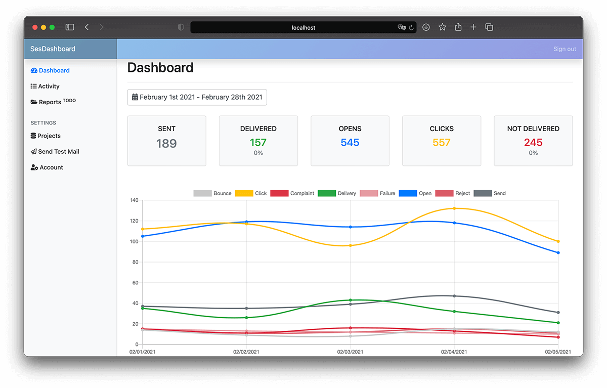

# About
SesDashboard is an Analytics UI for Amazon Simple Email Service.

With activity tracking tool you could check which email was successfully delivered or there we any problems. Also you will be able to view detailed events log like mail opens and clicks info. Useful for transactional mails.

SesDashboard is a free self-hosted solution which works as stand-alone app. No existing code needs to be changed.

# Documentation
Documentation available at https://sesdashboard.readthedocs.io/

### Screenshots

